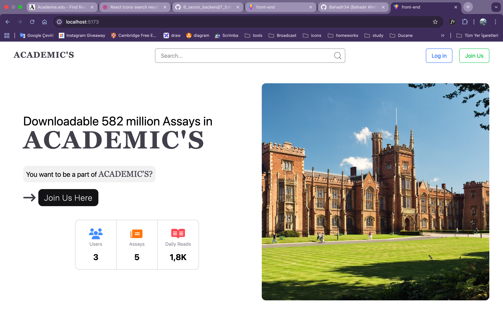
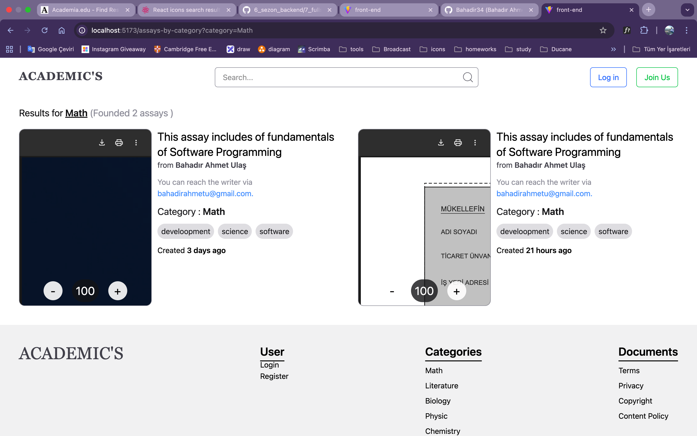
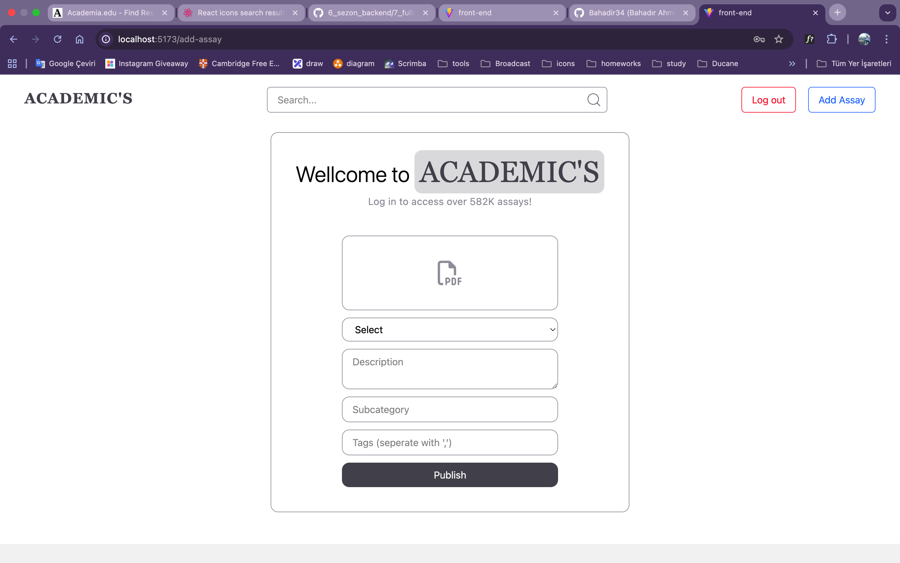

## Academic Writes — Fullstack App

A full‑stack web application for sharing and discovering academic assays. Users can register and log in, upload PDF files to cloud storage, browse by category, search descriptions, and view stats. The backend exposes a REST API with JWT authentication and MongoDB models; the front‑end is a modern React app built with Vite and Tailwind CSS.

### Key Features
- **Authentication**: Register, login, logout with JWT stored in an HTTP‑only cookie.
- **Assay management**: Upload PDF via multipart form, store file in Firebase Storage, persist metadata in MongoDB.
- **Browse & search**: List all assays, filter by category, and search by description (case‑insensitive regex).
- **Categories overview**: Aggregate counts per category.
- **Protected routes**: Selected endpoints require a valid JWT via cookie or Authorization header.

### Subject and Scope
This project focuses on academic content management and discovery. It demonstrates:
- Designing Mongoose schemas for users and essays with relations.
- Implementing secure auth (password hashing, JWT) and request guarding.
- Handling file uploads (PDF) with `multer` and offloading storage to Firebase.
- Building a responsive React UI with Tailwind, routing, and API integration.

---

## Tech Stack and Packages

### Backend (Node.js/Express)
- express (5.x)
- mongoose (8.x)
- jsonwebtoken (9.x)
- bcrypt (6.x)
- validator (13.x)
- cookie-parser (1.x)
- cors (2.x)
- multer (2.x)
- firebase-admin (13.x)
- dotenv (17.x)
- uuid (13.x)
- nodemon (3.x) — dev runtime

### Front‑end (React + Vite + Tailwind)
- react (19) and react-dom (19)
- react-router-dom (7)
- axios (1.x)
- tailwindcss (4) and @tailwindcss/vite
- dayjs (1.x)
- millify (6.x)
- ESLint + React plugins
- vite (7)

---

## Project Structure

```text
backend/
  configs/          # env, firebase, MongoDB setup
  controller/       # route handlers (auth, users, assays)
  entities/         # Mongoose models (User, Assay)
  middlewares/      # auth (JWT) and multer upload config
  routes/           # Express routers (auth, user, assay)
  server.js         # app bootstrap

front-end/
  src/
    pages/          # Home, Login, Register, Assays, Add Assay
    components/     # Header, Footer
    store/          # Global provider
    configs/        # axios base API config
  index.html, vite config and assets
```

---

## Backend Overview

### Environment Variables
Create `backend/.env` with:

```ini
PORT=3000
MONGO_URI=mongodb+srv://...
API_KEY_SECRET=your_jwt_secret
FIREBASE_STORAGE_BUCKET=your-project.appspot.com
# firebase-admin is initialized from serviceAccountKey.json
```

Place your Firebase Admin SDK credentials at `backend/serviceAccountKey.json` and ensure `backend/configs/firebase.js` loads it.

### Scripts
```bash
cd backend
npm start   # runs nodemon server.js
```

### Server
- CORS origin: `http://localhost:5173`
- Base path: `/api/v1`
- JSON body parsing and cookie parsing enabled

### Data Models
- `User`
  - firstName, lastName (alphabetic validation)
  - email (unique, valid)
  - password (hashed with bcrypt, strong password validation)
  - isActive (boolean)
  - assays, likedAssays: ObjectId[] -> `Assay`

- `Assay`
  - pdfFile: string (required)
  - description: string (min length validation)
  - category: enum [Math, Literature, Biology, Physic, Chemistry, Philosophy, Religion, History, Geography, Software]
  - subCategory?: string
  - tags?: string[]
  - readsCount: number
  - writedBy: ObjectId -> `User`

### Auth Flow
- Register: creates a user; passwords are hashed on `save`.
- Login: verifies credentials with bcrypt, creates JWT via `createJWT(user._id)`, sets cookie `token` (httpOnly).
- Protected routes: middleware reads cookie or `Authorization` header, verifies JWT with `API_KEY_SECRET`, loads user, and attaches it to `req.user`.

### File Upload Flow
1. Client submits multipart form with `pdfFile` and assay metadata.
2. `multer` stores the file temporarily on disk.
3. `firebase-admin` uploads to your bucket with a UUID‑based destination.
4. File is made public and a signed URL is generated and persisted in `Assay.pdfFile`.

### API Endpoints

Base URL: `http://localhost:3000/api/v1`

- Auth
  - `POST /login`
  - `POST /register` (uses uniqueness check)
  - `POST /logout`

- Users
  - `GET /user` — protected, returns sanitized current user
  - `GET /number-of-users` — returns user count

- Assays
  - `GET /get-all-assays` — list all assays
  - `POST /save-assay` — protected, multipart form
    - fields: `pdfFile` (file), `category`, `description`, `subCategory?`, `tags` (comma‑separated)
  - `GET /get-assay?category=Software` — filter by category
  - `GET /get-assay-categorise` — category -> count map
  - `GET /get-assays-via-search-param?search=keyword` — search descriptions

---

## Front‑end Overview

### Dev Server
```bash
cd front-end
npm run dev
```

### Routing
- `/` — Home (hero, categories, how‑it‑works)
- `/login` — Login form
- `/register` — Register form
- `/assays-by-category` — Listing filtered by category
- `/add-assay` — Protected page to upload an assay (PDF)

### API Client
`src/configs/apiConfig.js` configures Axios:
```js
baseURL: "http://localhost:3000/api/v1",
withCredentials: true
```
Cookies are sent automatically for protected requests.

### Styling
Tailwind CSS 4 with the Vite plugin, utility‑first responsive UI.

---

## Getting Started (Local)

1) Backend
```bash
cd backend
npm i
cp serviceAccountKey.example.json serviceAccountKey.json  # or add your JSON
cp .env.example .env                                     # fill values
npm start
```

2) Front‑end
```bash
cd front-end
npm i
npm run dev
```

Open `http://localhost:5173` in your browser.

---

## Environment Setup Notes
- Ensure your MongoDB connection string is valid and accessible.
- Firebase Storage bucket must exist and match `FIREBASE_STORAGE_BUCKET`.
- CORS origin defaults to Vite dev URL; update in `backend/server.js` if needed.

---

## Screenshots & Demo GIF

 
### Demo


### Screenshots



 

Tips to record a GIF:
- Use tools like ScreenToGif (Windows), Kap (macOS), or Peek (Linux).
- Keep the clip short (10–20s), optimized below ~10MB.
- Place the file at `front-end/public/demo.gif` and commit it.

---

## Development Notes
- JWT can be provided via cookie (default) or `Authorization` header.
- `tags` are saved by splitting a comma‑separated string from the form.
- For production, set `secure: true` on cookies and adjust CORS.

---

## License
Specify your license here (e.g., MIT). Copyright © Bahadir34

# ACADEMIC'S
This project is created to share assays and overviews assays. 